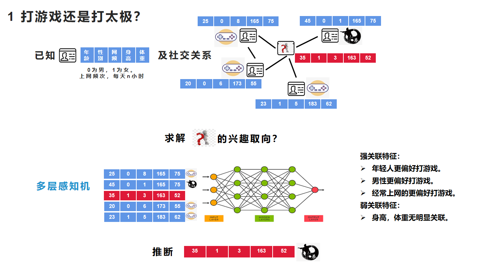
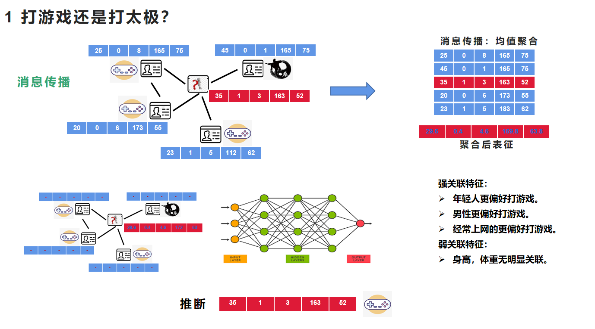
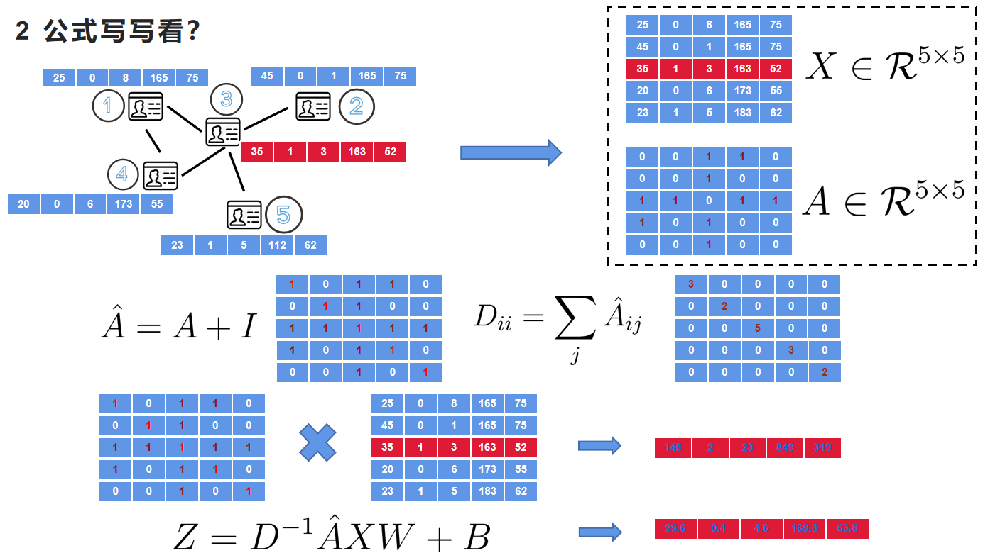
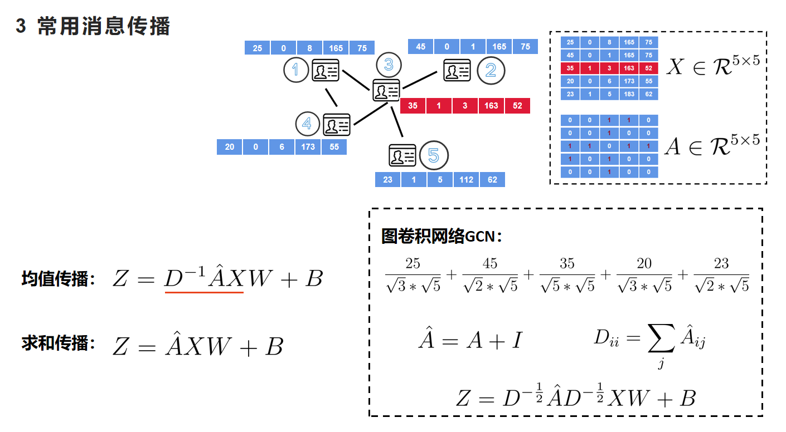
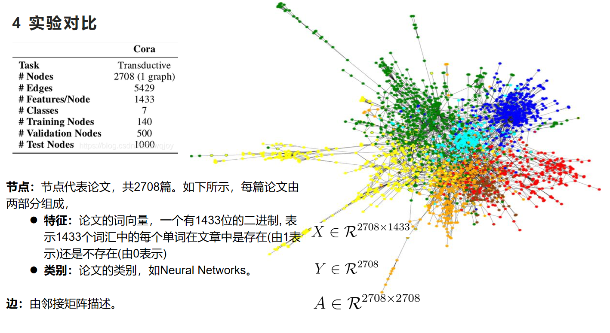
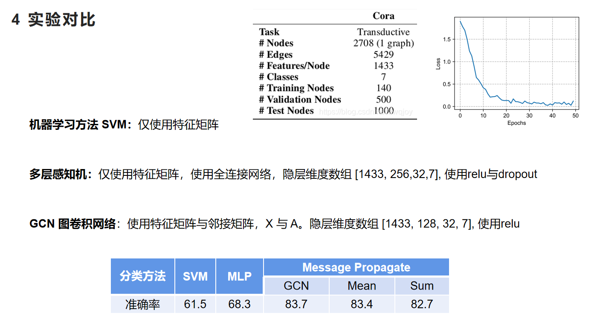
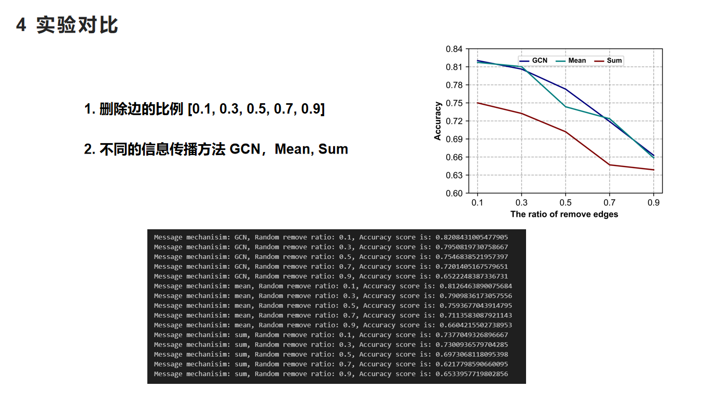
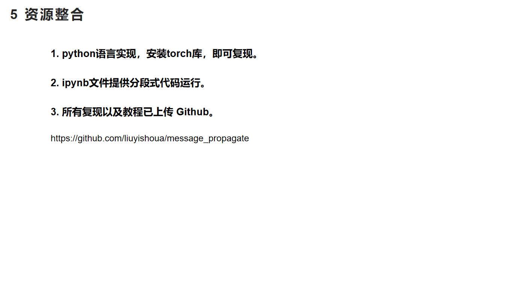

# A tutorial of message propagate in GNN
A tutorial of Graph Neural Network, including `PPT` and `ipynb` file. We compared `GNN` with machine learning method `SVM` and classify neural network `MLP`. And analyse the different message propagate methods (like GCN, mean and sum) and the impact of the removal ratio of edges.

教程适用场景，个人学习与组会分享。

使用`torch`实现三种信息传播过程。使用`Cora`引文数据集进行实验，探索了`删除边的比例`对模型分类的影响，发现删除的边的比例越多，模型表现越差，最后将退化为MLP模型所表现出来的分类性能。

### Step

1. 导入数据与处理 (使用引文网络Cora数据集)。

2. SVM 进行分类任务

3. MLP 进行分类任务

4. GCN 进行分类任务

    **GCN 消息传播**

    * $\hat{A} = A + I, D_{ii} = \sum_j{\hat{A}_{ij}},  Z = D^{-\frac{1}{2}} * \hat{A} * D^{-\frac{1}{2}}$

    **mean 消息传播**

    * $\hat{A} = A + I, D_{ii} = \sum_j{\hat{A}_{ij}},  Z = D^{-1} * \hat{A} $

    **sum 消息传播**

    * $\hat{A} = A + I,  Z = \hat{A} $

5. 随机删除边

    * 随机丢弃边，设置为 [0.1, 0.3, 0.5, 0.7, 0.9]

### Slide

